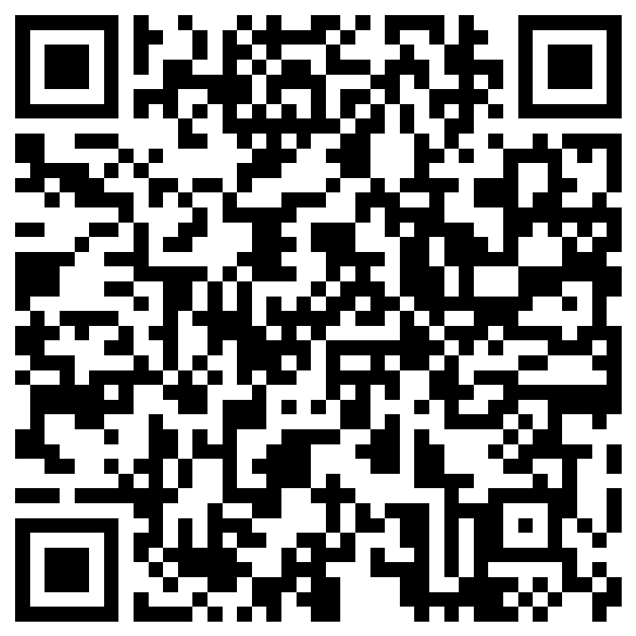
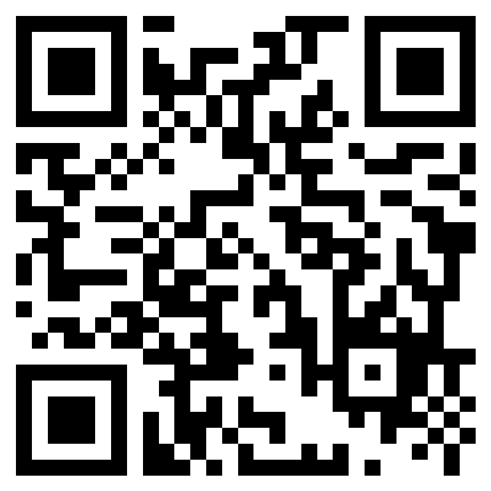

## BEADL beta user sign up
Before being able to access the current beta version of the BEADL editor, you have to fill out the sign up sheet accessible via link [https://forms.office.com/r/CrFCDzh3rP](https://forms.office.com/r/CrFCDzh3rP) or QR code:

## BEADL tutorial
The instructions for the BEADL tutorial will be available soon.

## We value your feedback
We appreciate your time and efforts while using the current beta version of BEADL. Your feedback is important to us, as we want to improve BEADL to meet the neuroscience community's requirements and needs.

Please use the form accessible via link [https://forms.office.com/r/gHZm6F58P4](https://forms.office.com/r/gHZm6F58P4) or QR code below to leave your feedback.

Thank you!

## Contact
If you have questions, feedback or general request, please contact Michael Wulf via email michael.wulf (at) wustl.edu
